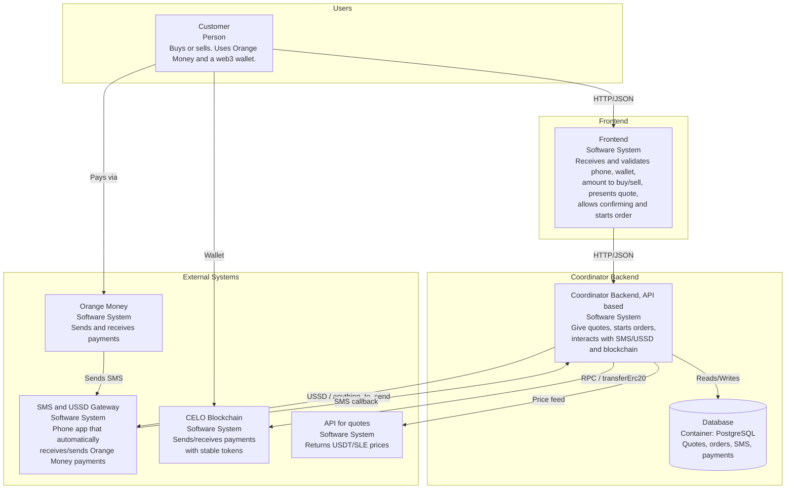
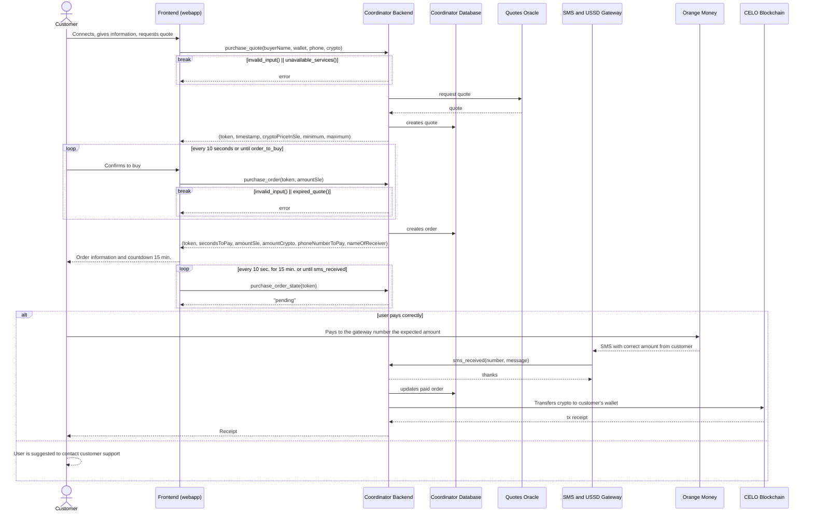
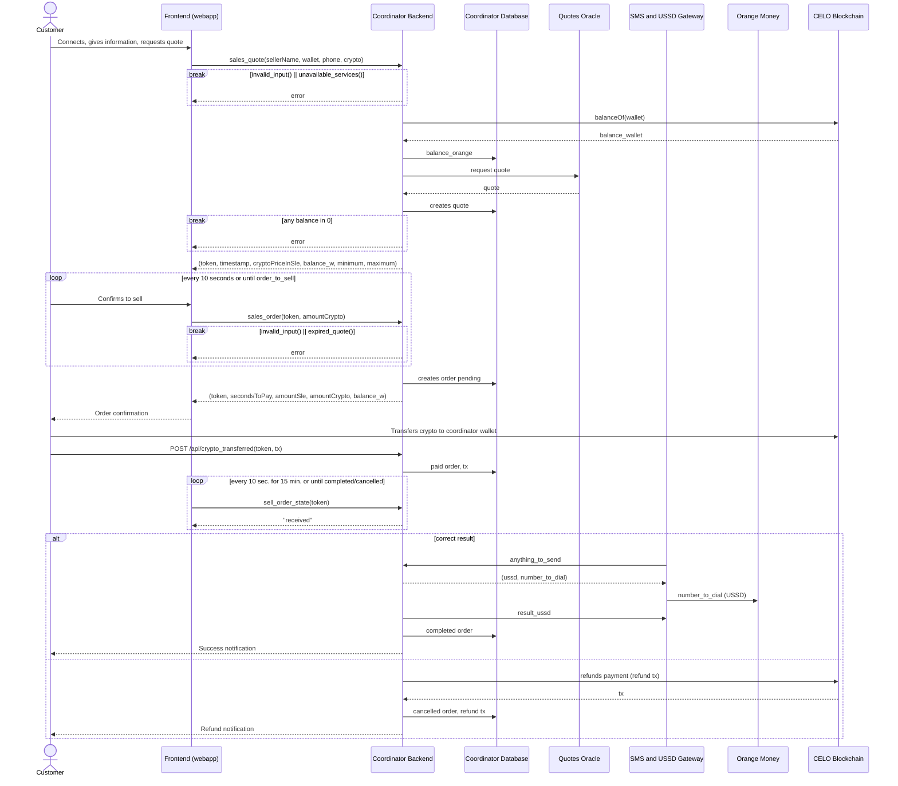

# Architecture

## Overview

`stable-sl` es un único repositorio. El backend (coordinator) está integrado
como **submodule** en `apps/stable-sl/app/api/` (no es una aplicación Next.js
aparte): las rutas del API se sirven desde el mismo frontend.

| Componente | Ubicación | Propósito |
|---|---|---|
| Frontend + API | `apps/stable-sl/` | UI + rutas API (`app/api/*`), BD, servicios |
| Coordinator (submodule) | `apps/stable-sl/app/api/` | Lógica de órdenes, blockchain y Orange Money |
| Smart contracts | `apps/hardhat/` | Contratos (MockG para pruebas) y despliegue |

```
┌──────────────┐     HTTP/JSON     ┌──────────────────────────────┐     Blockchain     ┌─────────┐
│   Frontend   │ ────────────────> │  Coordinator (app/api)       │ ────────────────> │  Celo   │
│ (stable-sl)  │ <──────────────── │  (misma app Next.js)         │ <──────────────── │ (USDT,  │
└──────────────┘                   │                              │                   │  G$)    │
                                   │ PostgreSQL                   │                   └─────────┘
                                   │                              │
                                   │  ┌────────────┐              │     SMS / Orange
                                   │  │  Kysely    │              │ <──────────────── Orange Money
                                   │  │  ORM       │              │
                                   │  └────────────┘              │
                                   └──────────────────────────────┘
                                           │
                                           │ USSD / anything_to_send
                                           v
                                   ┌──────────────────┐
                                   │ Gateway (Phone)  │
                                   └──────────────────┘
```

---

## C4 Architecture Diagram



---

## On-Ramp Flow (Buy Crypto)



---

## Off-Ramp Flow (Sell Crypto)



---

## On-Ramp Flow (Text Summary)

1. **Frontend** calls `GET /api/purchase_quote` with buyer info.
2. **Frontend** calls `GET /api/purchase_order` with quote token and SLE amount.
3. **Buyer** sends SLE via Orange Money to the operator phone.
4. Orange Money sends an SMS notification → **gateway**.
5. **POST /api/sms_received** parses the SMS, updates order to `received`, and transfers crypto to the buyer's wallet.
6. **Frontend** polls `GET /api/purchase_order_state` until state is `paid`.

## Off-Ramp Flow (Text Summary)

1. **Frontend** calls `GET /api/sales_quote` with seller info.
2. **Frontend** calls `GET /api/sales_order` with quote token and crypto amount.
3. **Seller** transfers crypto from their wallet to the coordinator wallet.
4. Seller or gateway calls **POST /api/crypto_transferred**, order → `received`.
5. **Frontend** polls `GET /api/sales_order_state` until state is `received`.
6. **Gateway** polls `GET /api/anything_to_send`, gets USSD code.
7. Operator executes USSD to send SLE via Orange Money to seller.
8. **Gateway** calls **POST /api/report_send** to confirm, order → `paid`.

---

## Database

PostgreSQL gestionado con **Kysely** (antes Drizzle). Seis tablas (ver
`apps/stable-sl/app/api/db/db.d.ts` para el tipo `DB`):

| Table | Purpose |
|---|---|
| `purchasequote` | Cotizaciones de compra (buy crypto). |
| `purchaseorder` | Órdenes de compra. |
| `salesquote` | Cotizaciones de venta (sell crypto). |
| `salesorder` | Órdenes de venta. |
| `smslog` | Registro de SMS entrantes de Orange Money. |
| `movementsmobile` | Movimientos y saldo de Orange Money del operador. |

Las columnas monetarias/precio/saldo usan `numeric` (no `real`). La migración
`apps/stable-sl/app/api/db/migrations/20260908120000_numeric_fks_indexes.ts`
agrega las claves foráneas y los índices (la BD de producción solo tenía
`PRIMARY KEY (id)`):

- FK `purchaseorder.quoteId → purchasequote.id`
- FK `salesorder.quoteId → salesquote.id`
- FK `movementsmobile.salesOrderId → salesorder.id`
- FK `movementsmobile.purchaseOrderId → purchaseorder.id`
- Índices en `token`, `quoteId`, `state`, `phoneNumber`, etc.

---

## Price Strategy

Prices are set in env vars (`USD_IN_SLE_BUY`, `USD_IN_SLE_SELL`, etc.) and adjusted manually. The goal is not short-term profit but adoption:

- **Buy price (USD_IN_SLE_BUY):** higher than midrate — operator earns spread.
- **Sell price (USD_IN_SLE_SELL):** lower than midrate — operator earns spread.
- KYC/whitelisted wallets (`KYC1`-`KYC4`) get higher limits (`MAX_SLE_WHITELISTED`).

## Authentication

- For the customer — coordinator backend: a randomly generated authentication token.
- For the coordinator — gateway: a shared secret to encrypt messages.
